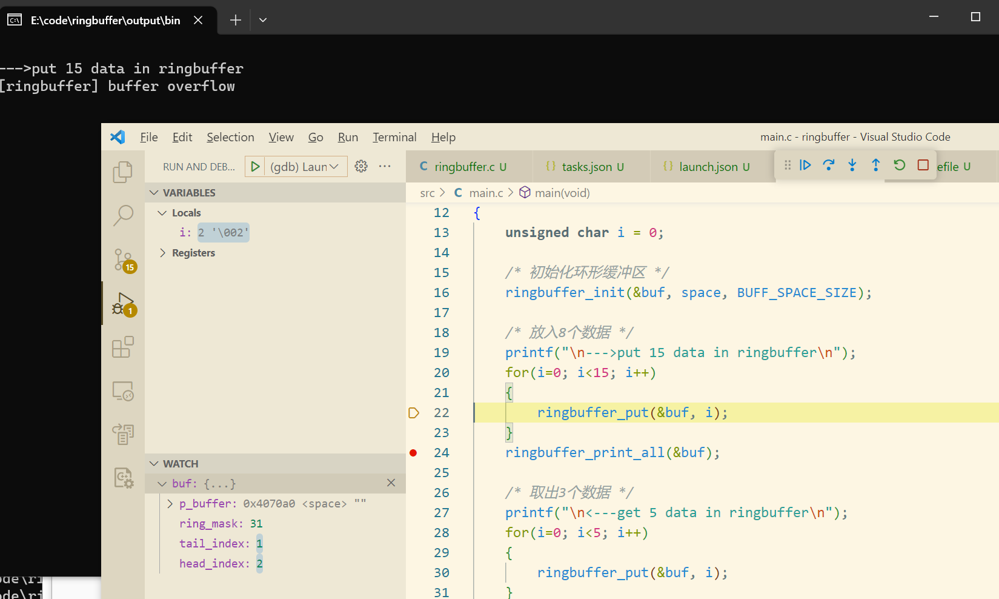
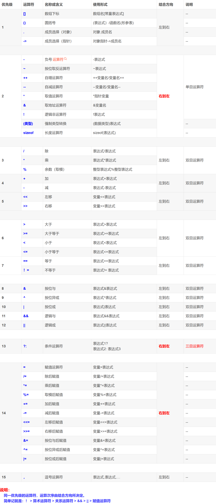

## 目录

[TOC]

### 一、背景

#### 1.1 相关数据结构

```c
typedef struct _ringbuffer_t ringbuffer_t;
struct _ringbuffer_t
{
    cat_uint8_t      *p_buffer;     /* 放置数据的缓冲区地址 */
    cat_uint32_t      ring_mask;    /* 用于循环头尾索引的掩码，用于代替取余操作 */
    cat_uint32_t      tail_index;   /* 尾部索引 */
    cat_uint32_t      head_index;   /* 头部索引 */
};
```

### 1.2 函数原型

```c
static inline cat_uint8_t ringbuffer_is_full(ringbuffer_t *p_ringbuffer)
{
    cat_uint8_t ret;

    ret = (
        (p_ringbuffer->head_index - p_ringbuffer->tail_index) & (p_ringbuffer->ring_mask) == 
        (p_ringbuffer->ring_mask)
        );

    return ret;
}
```

> note: 使用 ring_mask = buffer_size - 1 来代替取余操作，但是要求 buffer_size 必须为 2^n

### 二、问题描述

本来缓冲区没有满，计算出来还是满了，如图，只放入了一个数据，放入第二个数据时就提示溢出了



### 三、问题原因

#### 3.1 c 源码分析

因为 `ringbuffer.c` 中 `ringbuffer_is_full` 函数里

```c
ret = (
        (p_ringbuffer->head_index - p_ringbuffer->tail_index) & (p_ringbuffer->ring_mask) == 
        (p_ringbuffer->ring_mask)
        );
```

简写一下

```c
(head_index - tail_index) & (ring_mask) == (ring_mask)
```

少了一对括号，因此本来缓冲区没有满，计算出来还是满了

正确的代码应该是

```c
ret = (
        ((p_ringbuffer->head_index - p_ringbuffer->tail_index) & (p_ringbuffer->ring_mask)) == 
        (p_ringbuffer->ring_mask)
        );
```

#### 3.2 不同情况的反汇编分析

给出反汇编的区别

##### 3.2.1 没有括号的ringbuffer.o 的 objdump 结果

```assembly
static inline cat_uint8_t ringbuffer_is_full(ringbuffer_t *p_ringbuffer)
{
...
    ret = (
        (p_ringbuffer->head_index - p_ringbuffer->tail_index) & (p_ringbuffer->ring_mask) == 
        /* p_ringbuffer->head_index - p_ringbuffer->tail_index -> %eax寄存器 */
   6:	8b 45 08             	mov    0x8(%ebp),%eax
   9:	8b 40 0c             	mov    0xc(%eax),%eax
   c:	89 c2                	mov    %eax,%edx
   e:	8b 45 08             	mov    0x8(%ebp),%eax
  11:	8b 40 08             	mov    0x8(%eax),%eax
  14:	29 c2                	sub    %eax,%edx
  16:	89 d0                	mov    %edx,%eax
    ret = (
  18:	83 e0 01             	and    $0x1,%eax
  1b:	88 45 ff             	mov    %al,-0x1(%ebp)
        (p_ringbuffer->ring_mask)
        );
...
```

##### 3.2.1 有括号的ringbuffer.o 的 objdump 结果

```assembly
static inline cat_uint8_t ringbuffer_is_full(ringbuffer_t *p_ringbuffer)
{
...
    ret = (
        ((p_ringbuffer->head_index - p_ringbuffer->tail_index) & (p_ringbuffer->ring_mask)) == 
   6:	8b 45 08             	mov    0x8(%ebp),%eax
   9:	8b 50 0c             	mov    0xc(%eax),%edx
   c:	8b 45 08             	mov    0x8(%ebp),%eax
   f:	8b 40 08             	mov    0x8(%eax),%eax
  12:	29 c2                	sub    %eax,%edx
  14:	8b 45 08             	mov    0x8(%ebp),%eax
  17:	8b 40 04             	mov    0x4(%eax),%eax
  1a:	21 c2                	and    %eax,%edx
        (p_ringbuffer->ring_mask)
  1c:	8b 45 08             	mov    0x8(%ebp),%eax
  1f:	8b 40 04             	mov    0x4(%eax),%eax
        ((p_ringbuffer->head_index - p_ringbuffer->tail_index) & (p_ringbuffer->ring_mask)) == 
  22:	39 c2                	cmp    %eax,%edx
  24:	0f 94 c0             	sete   %al
    ret = (
  27:	88 45 ff             	mov    %al,-0x1(%ebp)
        );
...
```

从没有括号的反汇编代码第15行：

```assembly
18:	83 e0 01             	and    $0x1,%eax
```

可以看出是将`(p_ringbuffer->head_index - p_ringbuffer->tail_index)`和`(p_ringbuffer->ring_mask) == 
        (p_ringbuffer->ring_mask)`相与了

~~但是奇怪的是 c 语言中按位与(&)的优先级比 == 更高~~

~~我麻了~~

### 四、总结

~~虽然在 c 语言中 & 比 == 运算符优先级更高~~，但是 & 是右结合，所以如果不加括号会让 == 先处理

==作为按位与的 & 比 == 运算符优先级低并且 & 还是右结合==

附上优先级表


